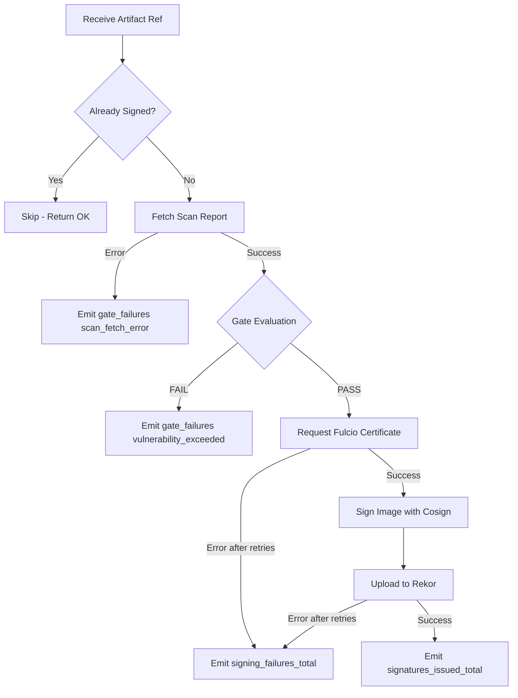

# Signing Pipeline

## Pipeline Flow

The signing pipeline executes the following steps for each artifact:

## Step Details

### 1. Idempotency Check
- Queries Harbor accessories API for existing `signature.cosign` type
- 5-second timeout per attempt, 3 retries
- On check failure: proceeds as if unsigned (fail-open for availability)

### 2. Scan Report Fetch
- GET `/api/v2.0/projects/{project}/repositories/{repo}/artifacts/{digest}/additions/vulnerabilities`
- 30-second timeout per attempt
- Authenticated with Robot_Account (Basic auth)
- 3 retries with exponential backoff (1s base, 10s max)
- On failure: gate decision = fail, reason = `scan_fetch_error`

### 3. Gate Evaluation
- Iterates all vulnerabilities in the report
- Compares each severity against threshold (default: High)
- **Pass**: all vulnerabilities < High (None, Low, Medium only)
- **Fail**: any vulnerability >= High
- Malformed severity strings treated as fail

### 4. Fulcio Certificate Request
- Reads projected SA token from `/var/run/secrets/tokens/fulcio-token`
- Validates token is not expired (fails immediately if stale)
- Requests short-lived certificate (10-minute TTL) from Fulcio
- 3 retries with exponential backoff (1s base, 8s max)
- Increments `fulcio_errors_total` on each failed attempt

### 5. Cosign Image Signing
- Signs image at `registry.platform.cuscal.io/<project>/<repo>@<digest>`
- Attaches annotations:
  - `scan-report=<report-digest>`
  - `trivy-db=<db-version>`
  - `policy=high`
  - `timestamp=<RFC3339 UTC>`
- Pushes signature using Robot_Account credentials

### 6. Rekor Upload
- Records signing event in the transparency log
- 3 retries with exponential backoff (1s base, 8s max)
- Increments `rekor_errors_total` on each failed attempt
- Returns `RekorEntryUUID` on success

## OpenTelemetry Tracing

Each pipeline execution creates a parent span `ProcessArtifact` with child spans:

| Span Name | Description |
|-----------|-------------|
| `CheckExistingSignature` | Idempotency check against registry |
| `FetchScanReport` | Harbor API call for vulnerabilities |
| `EvaluateGate` | Severity threshold evaluation |
| `SignArtifact` | Fulcio + Cosign + Rekor combined |

## Retry Strategy

| Dependency | Max Retries | Base Delay | Max Delay | On Exhaustion |
|-----------|-------------|------------|-----------|---------------|
| Harbor (scan report) | 3 | 1s | 10s | Gate fail (scan_fetch_error) |
| Harbor (signature check) | 3 | 1s | 5s | Proceed as if unsigned |
| Fulcio | 3 | 1s | 8s | Gate fail (fulcio_error) |
| Rekor | 3 | 1s | 8s | Gate fail (rekor_error) |
